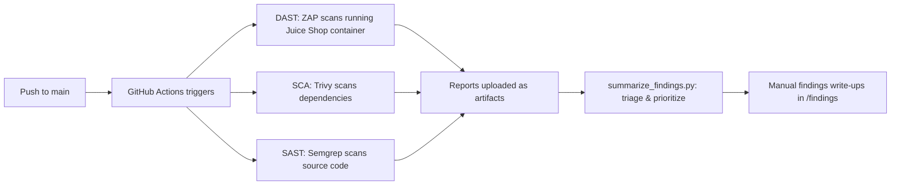

# AppSec Pipeline: OWASP Juice Shop

An automated application security pipeline that runs **DAST, SAST, and SCA** scans against [OWASP Juice Shop](https://owasp-juice.shop/), a deliberately vulnerable web application, on every push to this repository. Built as a hands-on project to practice the tools and skills used in application security testing.

> ⚠️ **Scope note:** All scanning in this project targets either a local Docker container or a fresh clone of the Juice Shop source code, both of which are intentionally vulnerable, sanctioned practice targets. No scanning was performed against any system without authorization.

## What this project demonstrates

| Area | How it's covered |
|---|---|
| **DAST** (Dynamic Application Security Testing) | [OWASP ZAP](https://www.zaproxy.org/) baseline scan against a running instance of the app |
| **SAST** (Static Application Security Testing) | [Semgrep](https://semgrep.dev/) scanning the application's source code for risky patterns |
| **SCA** (Software Composition Analysis) | [Trivy](https://aquasecurity.github.io/trivy/) scanning dependencies for known CVEs |
| **CI/CD automation** | GitHub Actions pipeline running all three scans on every push |
| **Scripting** | Python script that parses raw scan output and summarizes findings by OWASP/CWE |
| **Manual analysis & reporting** | Hand-written findings verifying and explaining specific vulnerabilities |
| **Supply-chain awareness** | Pipeline actions pinned to specific, verified-safe versions (see `security-pipeline.yml` comments) |

## Architecture



## Repository structure

```
.
├── .github/workflows/
│   └── security-pipeline.yml    # CI/CD pipeline: runs DAST, SAST, SCA on every push
├── findings/
│   ├── 01-sql-injection-login.md        # Manual finding (DAST, verified)
│   ├── 02-csp-header-missing.md         # Manual finding (DAST)
│   └── 03-hardcoded-jwt-secret.md       # Manual finding (SAST)
├── summarize_findings.py        # Parses ZAP's JSON report, prioritizes by severity + OWASP/CWE
└── README.md
```

## How the pipeline works

On every push to `main`, three jobs run in parallel:

1. **DAST (ZAP):** Starts Juice Shop in a Docker container, waits for it to be ready, then runs ZAP's baseline scan against it. This simulates how an attacker would probe the *running* application.
2. **SCA (Trivy):** Pulls the Juice Shop source code and scans its dependencies against known vulnerability databases, catching risks introduced by third-party libraries rather than the app's own code.
3. **SAST (Semgrep):** Scans the Juice Shop source code directly for risky coding patterns, hardcoded secrets, injection-prone queries, unsafe use of `eval()`, and more, without ever running the application.

Each job uploads its raw report as a downloadable GitHub Actions artifact.

## Key findings

Three vulnerabilities were manually verified and documented in detail (see `/findings`):

| # | Finding | Severity | Detected via | OWASP Category |
|---|---|---|---|---|
| 1 | SQL Injection in product search endpoint | High | DAST (ZAP) | A03:2021 - Injection |
| 2 | Content Security Policy header not set | Medium | DAST (ZAP) | A05:2021 - Security Misconfiguration |
| 3 | Hardcoded JWT signing secret | Medium-High | SAST (Semgrep) | A02:2021 - Cryptographic Failures |

Each write-up follows a standard vulnerability report format: description, steps to reproduce, evidence, impact, and remediation, modeled on real-world penetration test and bug bounty reporting conventions.

## Running it yourself

**Prerequisites:** Docker Desktop, Python 3.11+, Git.

```bash
# Clone this repo
git clone https://github.com/poonamlama/appsec-pipeline-juice-shop.git
cd appsec-pipeline-juice-shop

# Run Juice Shop locally
docker run --rm -p 3000:3000 bkimminich/juice-shop
# Visit http://localhost:3000

# Run a ZAP scan manually (requires OWASP ZAP installed)
# Automated Scan -> target http://localhost:3000 -> Attack

# Summarize a downloaded ZAP JSON report
python summarize_findings.py path/to/zap-report.json
```

The full pipeline (all three scans) runs automatically in GitHub Actions on every push, no local setup required to see it in action, just check the **Actions** tab on this repository.

## What I learned

This project was built while returning to hands-on security testing after a break, and most of the real learning came from debugging, not from the parts that worked on the first try:

- Diagnosing a GitHub Actions artifact-naming bug traced back to a third-party action's internal code, and rewriting the step to call the underlying tool directly instead of relying on a broken wrapper.
- Researching and avoiding a real supply-chain compromise (a malicious release of a GitHub Action used by this pipeline) by checking the action's security advisories before pinning a version.
- The practical difference between automated triage (what a script like `summarize_findings.py` can do) and manual security analysis (verifying a finding is real, explaining its impact, and writing it up for a non-technical stakeholder).
- Why DAST, SAST, and SCA each catch different things: DAST caught the SQL injection through the app's actual behavior; SAST caught a hardcoded secret that DAST could never have found by only interacting with the running app.

## Future improvements

- Extend `summarize_findings.py` to also parse Trivy and Semgrep JSON output, not just ZAP's.
- Add a severity-based failure threshold (e.g., fail the pipeline only on Critical/High findings) once the baseline noise is tuned out.
- Add a scheduled (nightly/weekly) full active ZAP scan, separate from the lightweight baseline scan that runs on every push.

---

*Built as part of a self-directed application security learning project. Juice Shop is an open-source, intentionally vulnerable application maintained by OWASP for training and testing purposes.*